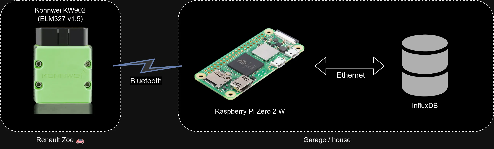

# 🚗 canze-rs

## How it works


## Description
This small linux tool is intended to connect to Renault Zoe's CAN bus and save some basic parameters to InfluxDB.<br>
Name of the project is inspired by (and a tribute to) a great [CanZE](https://canze.fisch.lu/) project.<br>

#### This tools is saving the following four parameters to Influx:
- SOC (state of charge)
- Active power from the grid (when charging from AC)
- SOH (battery's state of health)
- Total vehicle distance (odometer)

It is intended to running constantly (as a daemon) sensing when the car's OBD dongle is in range.
When the car is not in sleep mode (eg. when it is charging), then it is saving the parameters.

## Usage
```
canze-rs 0.1.0
Renault Zoe influxdb parameters logger

USAGE:
    canze-rs [OPTIONS]

OPTIONS:
    -c, --config <CONFIG>    Config file path [default: /etc/canze-rs.conf]
    -d, --debug              Enable debug info
    -h, --help               Print help information
    -V, --version            Print version information
```

## Config
The project uses a simple configuration file:<br>
`/etc/canze-rs.conf`<br>

A sample file may have the following contents:<br>
```
[general]
mac = 00:00:00:00:00:00  #enter your bluetooth dongle MAC here

[influxdb]
url = http://192.168.1.1:8086
db = zoe
```
